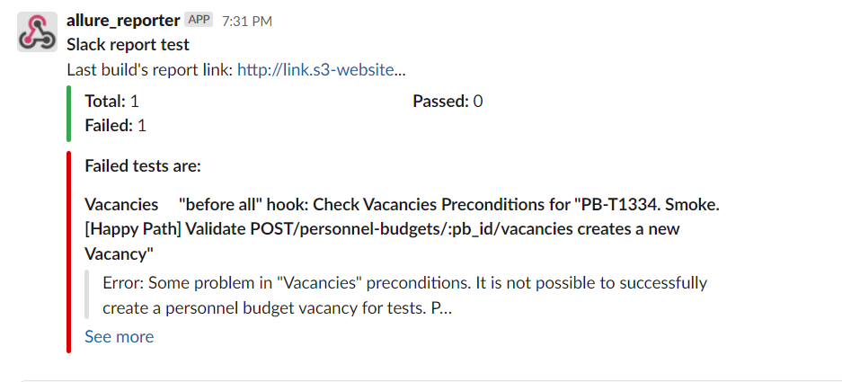

# mocha-slack-notifications-reporter
### Introduction 
This is a Node.js module that gives detailed report about your tests excution on any CI server such as Jenkins, CircleCI etc.
### Features 
- Easy report to the slack channel by using webhooks
- Test run summary
- Possible to send link to the report 
- Possible to send list of failed test along with their suite name
- Possible to send error stack of the failed test

### How to use 
Install the module by using command: 
`npm install mocha-slack-notifications-reporter`
It is recommended to use mocha programitically to configure your report in efficient way. Please take a look at below code.

	const Mocha = require('mocha')
    const mocha = new Mocha({
        reporter: 'mocha-slack-notifications-reporter',
        reporterOptions:{
            url:'https://hooks.slack.com/..', // Use your Incoming Webhook URL to post a message to Slack (Required)
            channel: '#general',              // Сhannel name                                             (Required)
            username: 'allure_reporter',      // The user who will send the messages                      (Required)
            linkToReport: 'http://...'        // Link to the report                                      (Optional)   
            logFailedTests: true,             // Send in a message the failed tests           <boolean>  (Optional)
            title: 'Slack report test'        // Message title                                           (Optional)  
        }
    })

You can pass comma-separated options to the reporter via mocha's `--reporter-options` flag. Options passed this way will take precedence over environment variables.

`$ mocha test.js --reporter mocha-slack-notifications-reporter --reporter-options url=url,channel=channel,usename=username`

The example output for the slack report looks like below.

    
    
    